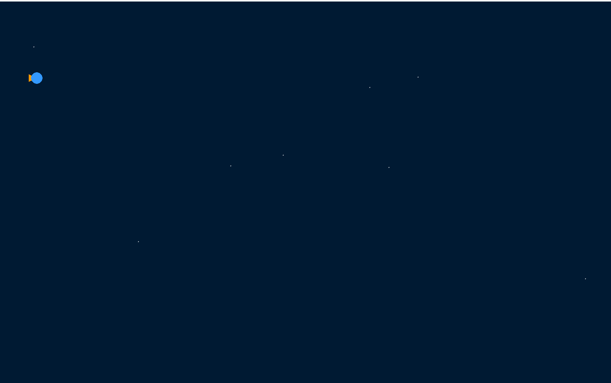
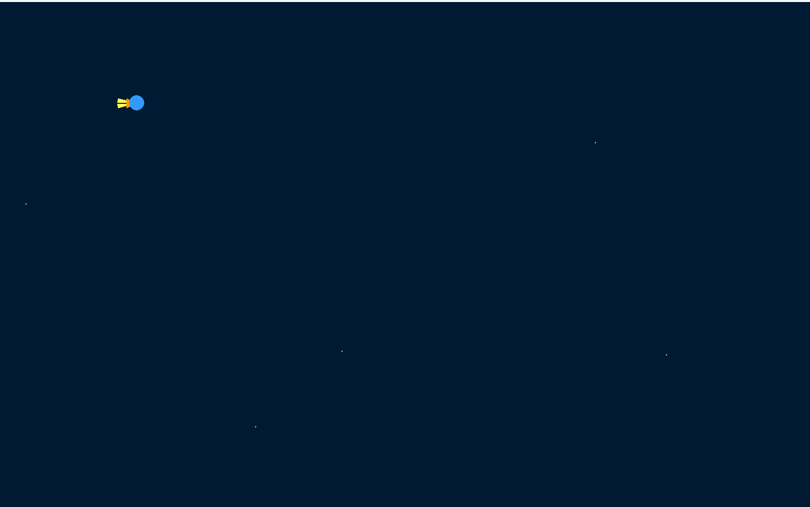
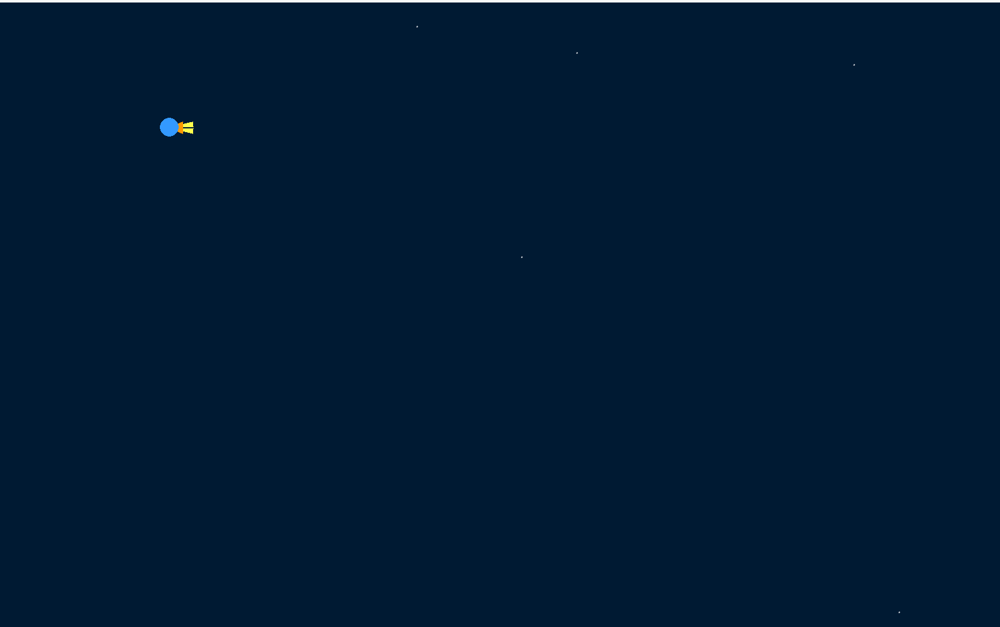
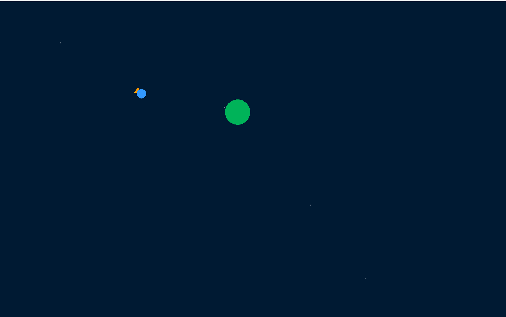
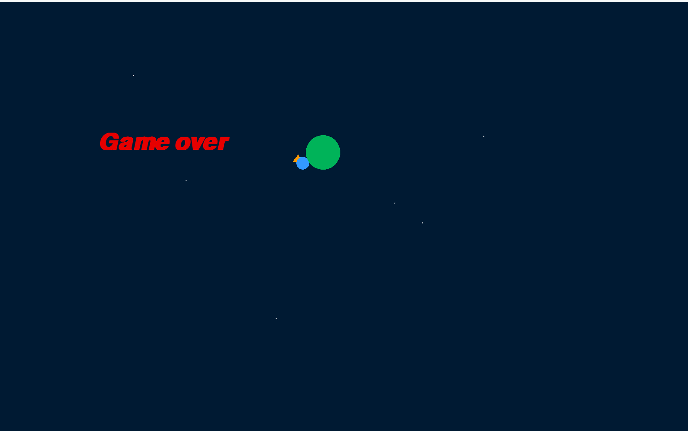

# Cosmic-Navigator

This Python project is a simple space exploration game created by KATOUZIAN Pouria using the Pygame library. The game features a spacecraft that can be controlled by the player to navigate through space while avoiding collisions with planets. Key features and components of the project include:

Libraries:

The project imports necessary libraries such as math, pygame, sys, and random for mathematical calculations, game development, system interactions, and random number generation.
Constants:

Several color constants are defined, including NOIR (black), BLEU (blue), ORANGE, JAUNE (yellow), ROUGE (red), and BLANC (white).
Key constants for arrow keys are defined using Pygame's pygame.K_* constants.
Parameters:

Various parameters are set, such as the window dimensions (dimension_fenetre), frames per second (images_par_seconde), initial spacecraft position (position_vaisseau), spacecraft orientation (orientation_vaisseau), and other constants related to the spacecraft and planet.
Functions:

The project defines several functions, including those for moving a point in a polar coordinate system (deplacer_pol), drawing a triangle representing the spacecraft (dessiner_triangle), displaying the spacecraft (afficher_vaisseau), handling keyboard input (gerer_touche), handling mouse button events (gerer_button), displaying the planet (afficher_planete), initializing calculations (initialiser_calculs), updating the spacecraft position (update_position), checking for collisions (check_collision), and displaying stars (afficher_etoiles).
Game Loop:

The main loop of the game continuously checks for user input, updates the spacecraft's position based on gravitational forces, displays the spacecraft, planet, stars, and checks for collisions.
Border Function:

The border function ensures that the spacecraft stays within the defined window borders.
Initialization:

Pygame is initialized, and fonts for displaying text are set. The game window is created, and the main clock (horloge) is set up.
Event Handling:

The project handles various events, including quitting the game, keyboard input for controlling the spacecraft, and mouse button events for interacting with the planets.
Display:

The game continuously updates and displays the spacecraft, stars, and planets, creating a dynamic and interactive space environment.
Note: The game features a spacecraft that can be controlled using arrow keys, with the objective of avoiding collisions with planets. The player can also interact with planets using the mouse. The game loop ensures continuous updates and displays at a defined frame rate.
